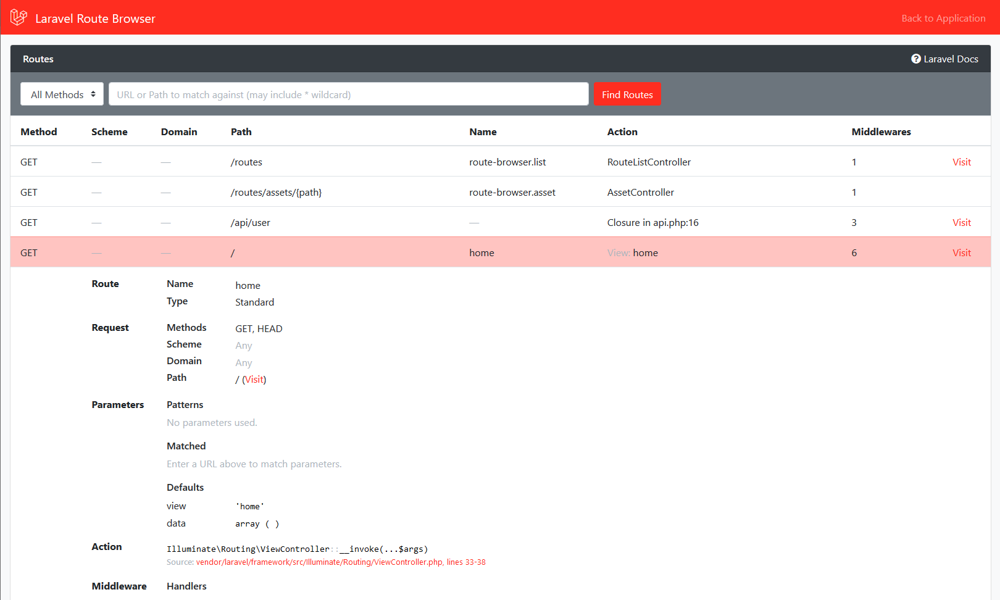

 Laravel Route Browser
================================================================================

[](https://packagist.org/packages/davejamesmiller/laravel-route-browser)
[](https://packagist.org/packages/davejamesmiller/laravel-route-browser)
[](https://packagist.org/packages/davejamesmiller/laravel-route-browser)
[](https://packagist.org/packages/davejamesmiller/laravel-route-browser)
[](https://packagist.org/packages/davejamesmiller/laravel-route-browser)
[](https://travis-ci.com/davejamesmiller/laravel-route-browser)
[](https://coveralls.io/github/davejamesmiller/laravel-route-browser?branch=master)

A web-based route list GUI for [Laravel](https://laravel.com/).

(Similar to [Pretty Routes](https://github.com/garygreen/pretty-routes), [Laravel Routes Explorer](https://labs.infyom.com/laravelgenerator/docs/routes-explorer) and [Laravel Route Summary](https://github.com/biscofil/laravel_route_summary), but with more details and better search.)




 Table of Contents
--------------------------------------------------------------------------------

- [Compatibility Chart](#compatibility-chart)
- [Installation](#installation)
- [Contributing](#contributing)
- [No Technical Support](#no-technical-support)
- [Changelog](#changelog)
- [License](#license)


 Compatibility Chart
--------------------------------------------------------------------------------

| Laravel Route Browser | Laravel   | PHP  |
|-----------------------|-----------|------|
| **1.0.0 – 1.1.0**     | 5.6+      | 7.1+ |


 Installation
--------------------------------------------------------------------------------

```bash
composer require --dev davejamesmiller/laravel-route-browser
```

Optionally publish and edit the config file (`config/route-browser.php`):

```bash
php artisan vendor:publish --tag=route-browser-config
```

Then visit `/routes` (or the path set in your config file).

For security, by default, Route Browser is only active if `APP_ENV=local` and `APP_DEBUG=true`, *or* you set `ROUTE_BROWSER_ENABLED=true`, in `.env`.

 Contributing
--------------------------------------------------------------------------------

**Documentation:** If you think the documentation can be improved in any way, please do [edit this file](https://github.com/davejamesmiller/laravel-route-browser/edit/master/README.md) and make a pull request.

**Bug fixes:** Please fix it and open a [pull request](https://github.com/davejamesmiller/laravel-route-browser/pulls). ([See below](#creating-a-pull-request) for more detailed instructions.) Bonus points if you add a unit test to make sure it doesn't happen again!

**New features:** Please build it and open a [pull request](https://github.com/davejamesmiller/laravel-route-browser/pulls). If you want to discuss it before doing too much work, make a proof-of-concept (either code or documentation) and open a [Draft PR](https://github.blog/2019-02-14-introducing-draft-pull-requests/) to discuss the details.


### Creating a pull request

The easiest way to work on Laravel Route Browser is to tell Composer to install it from source (Git) using the `--prefer-source` flag:

```bash
rm -rf vendor/davejamesmiller/laravel-route-browser
composer install --prefer-source
```

Then checkout the master branch and create your own local branch to work on:

```bash
cd vendor/davejamesmiller/laravel-route-browser
git checkout -t origin/master
git checkout -b YOUR_BRANCH
```

Now make your changes, including unit tests and documentation (if appropriate). Run the unit tests to make sure everything is still working:

```bash
scripts/test.sh
```

Then commit the changes. [Fork the repository on GitHub](https://github.com/davejamesmiller/laravel-route-browser/fork) if you haven't already, and push your changes to it:

```bash
git remote add YOUR_USERNAME git@github.com:YOUR_USERNAME/laravel-route-browser.git
git push -u YOUR_USERNAME YOUR_BRANCH
```

Finally, browse to the repository on GitHub and create a pull request.

(Alternatively, there is a [test app](https://github.com/davejamesmiller/laravel-packages-test) that you can use.)


### Using your fork in a project

To use your own fork in a project, update the `composer.json` in your main project as follows:

```json5
{
    // ADD THIS:
    "repositories": [
        {
            "type": "vcs",
            "url": "https://github.com/YOUR_USERNAME/laravel-route-browser.git"
        }
    ],
    "require": {
        // UPDATE THIS:
        "davejamesmiller/laravel-route-browser": "dev-YOUR_BRANCH"
    }
}
```

Replace `YOUR_USERNAME` with your GitHub username and `YOUR_BRANCH` with the branch name (e.g. `develop`). This tells Composer to use your repository instead of the default one.


### Unit tests

To run the unit tests:

```bash
scripts/test.sh
```

To check code coverage:

```bash
scripts/test-coverage.sh
```

Then open `test-coverage/index.html` to view the results. Be aware of the [edge cases](https://phpunit.de/manual/current/en/code-coverage-analysis.html#code-coverage-analysis.edge-cases) in PHPUnit that can make it not-quite-accurate.


### New version of Laravel

There is no maximum version specified in [`composer.json`](composer.json), so there is no need for a new version of Laravel Route Browser to be released every 6 months. However, this file will need to be updated to run tests against the new version:

- [`.travis.yml`](.travis.yml)
    - `matrix` (Laravel versions)
    - `php` (PHP versions)
    - `exclude` (Unsupported combinations)

If changes are required, also update:

- [`README.md`](README.md)
    - [Compatibility Chart](README.md#compatibility-chart)
    - [Changelog](README.md#changelog)

If backwards-incompatible changes cause the **minimum** supported versions of Laravel or PHP to change, update:

- [`composer.json`](composer.json)
    - `php/*`
    - `illuminate/*`

### Releasing a new version

*This section is for maintainers only.*

- Ensure the unit tests are updated ~~and have 100% coverage~~ (eventually)
- Update the [test app](https://github.com/davejamesmiller/laravel-packages-test), if appropriate, and test it manually
- Ensure the [README](README.md) is up to date, including:
    - Document any new features
    - [Compatibility Chart](README.md#compatibility-chart)
    - [Changelog](README.md#changelog)
- Merge the changes into the `master` branch (if necessary)
- Push the code changes to GitHub (`git push`)
- Make sure [all tests are passing](https://travis-ci.org/davejamesmiller/laravel-route-browser)
- Tag the release (`git tag 1.2.3`)
- Push the tag (`git push --tag`)


 No Technical Support
--------------------------------------------------------------------------------

Sorry, I don't offer any technical support, and GitHub Issues are disabled. That means I won't figure out why it's not working for you, I won't fix bugs for you, and I won't write new features on request - this is **free** software after all.

**But** the beauty of open source is you can do whatever you want with it! You can fork it, fix it, improve it and extend it. If you don't want to maintain your own fork, and you think other people would benefit from your changes, you can submit a [pull request](https://github.com/davejamesmiller/laravel-route-browser/pulls) to have your changes included in the next release.

If you get really stuck, I suggest you:

1. Read and re-read both this file and the [Laravel documentation](https://laravel.com/docs) to see if you missed something.
2. Dive into the source code and spend some time figuring out how it's meant to work and what's actually happening.
3. Try to reproduce the problem on a brand new Laravel project, in case it's an incompatibility with another package or your other code.
4. Ask your colleagues to help you debug it, if you work in a team.
5. Pay someone more experienced to help you (or if you work for a company, ask your boss to pay them).
6. Try posting on [Stack Overflow](https://stackoverflow.com/search?q=laravel+route+browser), [Laravel.io Forum](https://laravel.io/forum) or [Laracasts Forum](https://laracasts.com/discuss) (but I can't promise anyone will answer - they don't get paid either).
7. Use a different package instead.
8. Write your own.


 Changelog
--------------------------------------------------------------------------------

*Laravel Route Browser uses [Semantic Versioning](http://semver.org/).*


### [v1.1.0](https://github.com/davejamesmiller/laravel-route-browser/tree/1.1.0) (Fri 17 Jan 2020)

- Fix filtering by URL when not running in a subdirectory – Thanks to
  [Nguyễn Trần Chung](https://github.com/davejamesmiller/laravel-route-browser/pull/1)
- Add `excludes` array to config file – Also thanks to
  [Nguyễn Trần Chung](https://github.com/davejamesmiller/laravel-route-browser/pull/1)


### [v1.0.1](https://github.com/davejamesmiller/laravel-route-browser/tree/1.0.1) (Thu 2 Jan 2020)

- Fix displaying middlewares that are closures
- Fix displaying middlewares added in the controller rather than the route


### [v1.0.0](https://github.com/davejamesmiller/laravel-route-browser/tree/1.0.0) (Tue 31 Dec 2019)

- Initial release


 License
--------------------------------------------------------------------------------

*[MIT License](https://choosealicense.com/licenses/mit/)*

**Copyright © 2019-2020 Dave James Miller**

Permission is hereby granted, free of charge, to any person obtaining a copy of this software and associated documentation files (the "Software"), to deal in the Software without restriction, including without limitation the rights to use, copy, modify, merge, publish, distribute, sublicense, and/or sell copies of the Software, and to permit persons to whom the Software is furnished to do so, subject to the following conditions:

The above copyright notice and this permission notice shall be included in all copies or substantial portions of the Software.

THE SOFTWARE IS PROVIDED "AS IS", WITHOUT WARRANTY OF ANY KIND, EXPRESS OR IMPLIED, INCLUDING BUT NOT LIMITED TO THE WARRANTIES OF MERCHANTABILITY, FITNESS FOR A PARTICULAR PURPOSE AND NONINFRINGEMENT. IN NO EVENT SHALL THE AUTHORS OR COPYRIGHT HOLDERS BE LIABLE FOR ANY CLAIM, DAMAGES OR OTHER LIABILITY, WHETHER IN AN ACTION OF CONTRACT, TORT OR OTHERWISE, ARISING FROM, OUT OF OR IN CONNECTION WITH THE SOFTWARE OR THE USE OR OTHER DEALINGS IN THE SOFTWARE.
